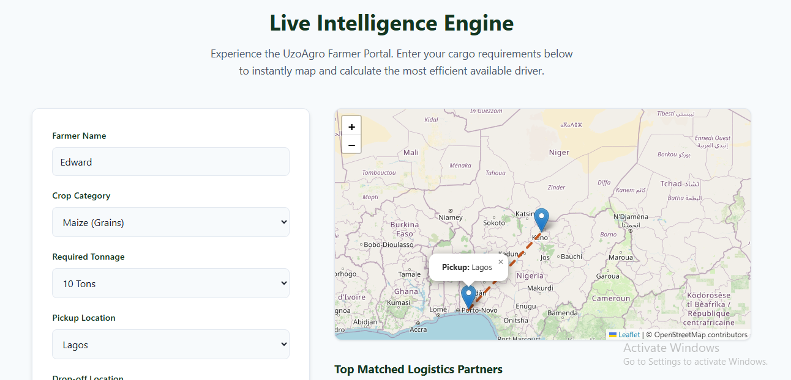

# 🚛 UzoAgro AI – Intelligent Agricultural Logistics


UzoAgro AI is a smart logistics and agricultural support ecosystem. We are solving one of the biggest drivers of food inflation and supply chain waste in Nigeria: **Empty Return Trips (Deadheading).**

By utilizing a custom Spatio-Temporal Intelligence Engine, UzoAgro seamlessly and securely matches farmers with available truck drivers heading in the right direction, optimizing for backhaul corridors and cargo compatibility. 

---

## 🎯 The Core Problem
1. **Logistics Inefficiency:** Trucks deliver goods from the South to the North and frequently return completely empty, wasting fuel and driving up transport costs.
2. **Crop Spoilage:** Farmers struggle to find available, affordable, and safe transportation for their harvest.
3. **Security:** Drivers cannot publicly broadcast their empty return routes due to highway insecurity.

## 🧠 Our Solution: The 5-Pillar Matching Engine
UzoAgro AI operates as a **Zero-Knowledge Broker**. Neither party sees the other's exact location until a match is secured. 
### 🖥️ Live Demo Preview





Instead of simple radius matching, our Python-based AI engine calculates matches using five dimensions:
1. **Capacity Masking:** Strict verification of truck tonnage.
2. **Temporal Fit:** Schedule alignment with 0-2 day tolerances.
3. **Deadhead Tolerance:** Calculating the maximum profitable empty-transit distance.
4. **Backhaul Corridor Vectoring:** Using cross-track vector mathematics to ensure the cargo drop-off aligns with the driver's intended return trajectory.
5. **Cargo Affinity Matrix:** Intelligently pivoting drivers to compatible crop categories (e.g., matching a grain driver with tubers, but rejecting perishables to prevent spoilage).

---

## 🌿 Upcoming Feature: AI Botanical Crop Diagnostics
*Currently in development by our AI Engineering team.*

UzoAgro isn't just about moving crops; it's about protecting them. We are integrating a free, NLP-driven diagnostic tool for our farmers. 
* **How it works:** A farmer describes a crop symptom (e.g., "My cassava leaves have yellow mosaic patches").
* **The Intelligence:** The AI processes the description and recommends accessible, natural, and safe herbal/botanical solutions to salvage the crop before harvest, reducing reliance on expensive synthetic chemicals.

---

## 🛠️ Tech Stack
Our MVP is built for speed, mathematical precision, and rapid deployment:
* **Backend Intelligence:** Python, Pandas, NumPy
* **API Layer:** FastAPI, Uvicorn
* **Frontend Demo:** HTML5, CSS3, Vanilla JavaScript
* **Geospatial Visualization:** Leaflet.js
* **Data:** Synthetic Agricultural Logistics Generator (`dataset_generator.py`)

---

## 🚀 How to Run the MVP Locally

Follow these steps to spin up the intelligence engine and the interactive map demo on your local machine.

### 1. Clone the Repository
```bash
git clone [https://github.com/YOUR_USERNAME/UzoAgro-AI.git](https://github.com/YOUR_USERNAME/UzoAgro-AI.git)
cd UzoAgro-AI